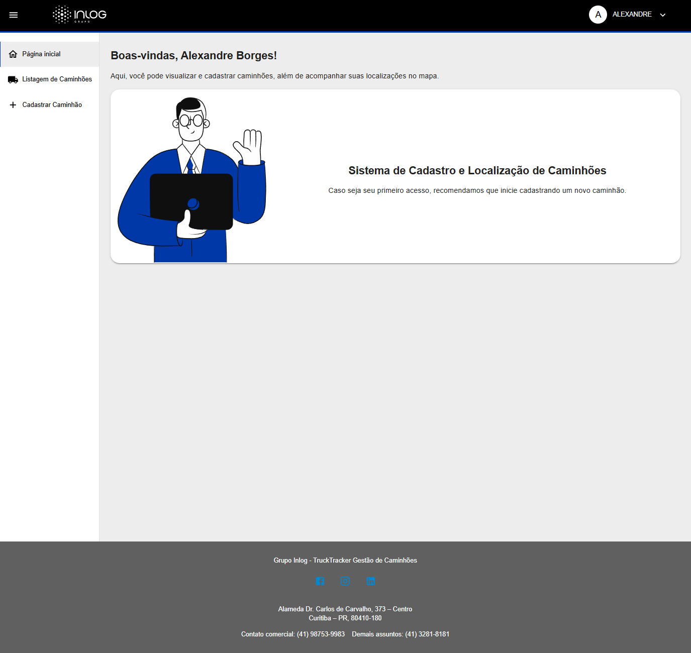
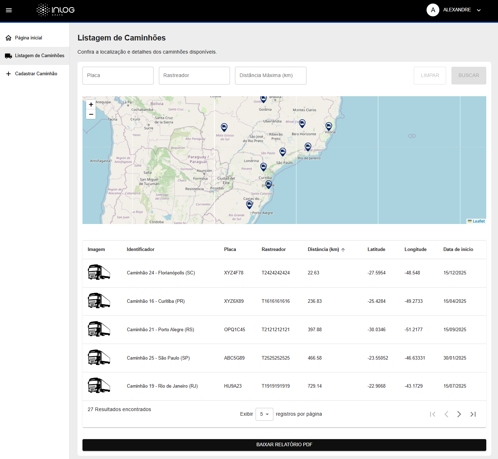
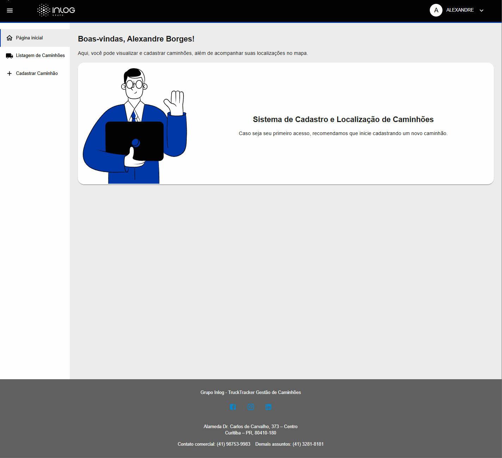
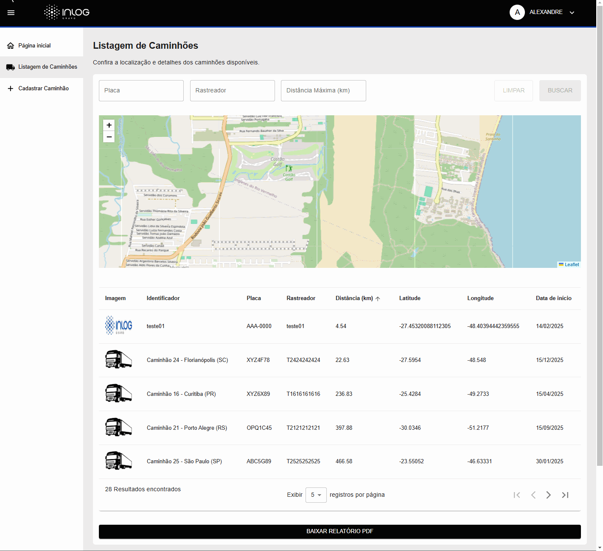
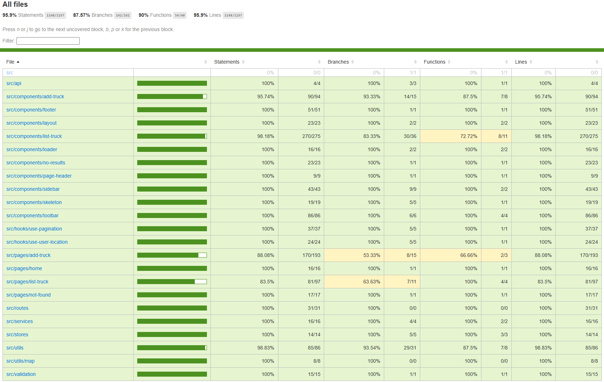

# TruckTracker - Desafio Inlog 🚀

## Descrição do Projeto 📜

Este projeto foi desenvolvido como parte do desafio técnico para a vaga de Frontend Developer na Inlog. O objetivo foi criar uma aplicação React com duas páginas principais:

1. **Listagem de Caminhões**: Exibe uma lista de veículos ordenados pela proximidade do usuário, com um mapa interativo (usando Leaflet) que mostra a localização de cada veículo.
2. **Adição de Caminhões**: Permite ao usuário cadastrar novos veículos, incluindo informações básicas e a localização (coordenadas).
   O projeto foi desenvolvido com React, TypeScript, e utiliza bibliotecas como Leaflet para mapas, Axios para requisições à API, e React Testing Library para testes automatizados.

---

## Pré-visualização 🎥

### Home

### Listagem de Caminhões

### Cadastro de Veículos

### GIF Sidebar, Toolbar e Home

### GIF Listagem

### GIF Cadastro

### GIF Exportar Relatório

---

## Coverage 🧪

---

## Funcionalidades ✨

- **Listagem de Veículos**:
  - Lista de veículos ordenada pela proximidade do usuário.
  - Mapa interativo com pins indicando a localização de cada veículo.
  - Ao clicar em uma linha da lista, o mapa é movido diretamente para a localização daquele caminhão.
  - Ao clicar no pin de um caminhão no mapa, é exibido um popup com as informações mais importantes do caminhão.
  - Integração com a API para buscar os dados dos veículos.
  - **Filtro de Veículos**: Possibilidade de filtrar os veículos por placa, número de rastreador ou distância.
- **Cadastro de Veículos**:
  - Formulário para cadastrar novos veículos.
  - Campos para identificação, placa, número de série do rastreador e coordenadas (latitude e longitude).
  - Validação de campos e feedback visual.
  - **Upload de Imagem**: Funcionalidade de upload de imagem para cada caminhão cadastrado, com a exibição da foto na listagem.
  - **Localização do Usuário**: Captura automática da localização do usuário no cadastro de veículos, facilitando o preenchimento do campo de localização.
- **Testes Automatizados**:
  - Testes para garantir que a listagem de veículos e o formulário de cadastro funcionem corretamente.
  - Testes de integração com a API.
- **Relatórios**:
  - **Botão para Baixar Relatório**: Permite ao usuário baixar a listagem de veículos em formato PDF.

---

## Bônus Implementados 🎁

- **Filtro de Veículos**: Adicionei um campo de busca que permite filtrar os veículos por placa, número de rastreador ou distância, facilitando a navegação pela lista.
- **Upload e Listagem de Imagem**: No formulário de cadastro, implementei a funcionalidade de upload de imagem para permitir o envio de uma foto do caminhão. A imagem também aparece na coluna imagem na listagem dos caminhões.
- **Localização do Usuário**: Na página de cadastro de caminhões, adicionei uma funcionalidade que captura automaticamente a localização atual do usuário e a exibe no mapa, facilitando o preenchimento do campo de localização e melhorando a experiência do usuário.
- **Edição e Exclusão de Caminhões**: Implementei a possibilidade de editar e excluir caminhões, com a criação de serviços e endpoints no MirageJS para simulação de API. Também foram implementados modais de edição e exclusão, juntamente com testes unitários para garantir o correto funcionamento dessas funcionalidades.
- **Interface Melhorada**: Implementei uma **toolbar** para facilitar a navegação, um **footer** com informações adicionais e uma **sidebar retrátil** para melhorar a organização e acessibilidade do layout.
- **Estrutura do Keycloak**: Preparei a estrutura do Keycloak para uma futura integração de autenticação e autorização no projeto, garantindo que a aplicação esteja pronta para ser escalada com segurança.
- **Migração de CRA para Vite**: Realizei a migração do projeto de **Create React App (CRA)** para **Vite**. A migração traz melhorias significativas, como tempos de build mais rápidos, inicialização mais ágil e uma configuração mais flexível, melhorando o desempenho geral da aplicação.
- **Instalação e Configuração do SonarQube**: Instalei e configurei o SonarQube no projeto para garantir a qualidade do código. Durante o desenvolvimento, fiz análises diárias no SonarQube para identificar e corrigir problemas de qualidade e garantir os melhores resultados possíveis no código.
- **Botão para Baixar Relatório**: Adicionei um botão na tela de listagem que permite ao usuário baixar um relatório contendo a listagem dos caminhões em formato PDF.

---

## Observações ⚠️

- **Uso do Redux**: Embora o Redux tenha sido utilizado no projeto para gerenciar o estado global dos caminhões após as requisições à API, esse gerenciamento não é essencial para a aplicação. O Redux foi implementado como parte do desafio técnico, mas sua utilização pode ser vista mais como um teste e um extra, pois não achei necessário a utilização completo do mesmo devido ao tamanho atual do projeto.
- **Gerenciamento do Estado Global**: Para gerenciar o estado global do snackbar e do loading, foi utilizado o **Zustand**, que proporciona uma abordagem mais leve e eficiente para esses casos de uso, sendo uma solução mais adequada e simples para o gerenciamento de estados localizados na aplicação.
- **Responsividade**: Não foquei no design responsivo para esse projeto, pois o tempo para o desafio foi um fator limitante. Meu principal foco foi garantir que as funcionalidades principais, como a listagem de caminhões, o cadastro de veículos e os testes unitários, estivessem bem implementadas. Caso o prazo fosse maior, eu teria dedicado mais tempo para aprimorar a responsividade e garantir que a aplicação fosse totalmente adaptável a diferentes dispositivos.
- **Padrão Smart Container**: Nos últimos commits, apliquei o padrão smart container na listagem de caminhões. Este padrão foi adotado porque, com o crescimento da aplicação, é importante separar a lógica de negócio e o gerenciamento de estado dos componentes de apresentação. Isso facilita a manutenção do código, criação de testes e melhora a escalabilidade e torna a aplicação mais modular. Com o tempo, esse padrão vai ajudar a reduzir a complexidade e facilitar a inclusão de novas funcionalidades sem grandes alterações na estrutura do projeto.

Com isso, em um projeto real, eu teria iniciado aplicando tanto a responsividade quanto o padrão smart container desde o começo.

---

## Tecnologias Utilizadas 🛠️

- **React**: Biblioteca principal para construção da interface.
- **TypeScript**: Para tipagem estática e melhor organização do código.
- **Vite**: Build tool rápida para desenvolvimento e produção.
- **MUI (Material UI)**: Biblioteca de componentes para estilização moderna.
- **Emotion**: Biblioteca de CSS-in-JS usada pelo MUI.
- **Leaflet & React Leaflet**: Biblioteca para exibição de mapas interativos.
- **Axios**: Para requisições HTTP à API.
- **SWR**: Gerenciamento de estado assíncrono para requisições e cache de dados.
- **Redux**: Para gerenciamento global de estado e armazenamento dos dados dos caminhões vindo da API.
- **React Hook Form**: Gerenciamento de formulários com validação eficiente.
- **Zod**: Biblioteca de validação de schemas integrada ao React Hook Form.
- **UUID**: Para geração de identificadores únicos universais.
- **Zustand**: Gerenciamento de estado leve e eficiente.
- **MirageJS**: Simulação de API para desenvolvimento sem backend.
- **Keycloak JS**: Gerenciamento de autenticação e autorização.
- **JSPDF & JSPDF-Autotable**: Geração de PDFs, incluindo tabelas formatadas.
- **React Router**: Para gerenciamento de rotas.
- **Styled Components**: Para estilização dos componentes.
- **Day.js**: Biblioteca de manipulação de datas que foi escolhida ao invés do Date-fns por ser mais leve e ter uma API similar ao moment.js, oferecendo uma experiência de uso mais simples e rápida, além de ser recomendada pela documentação do MUI.
- **PNPM**: Gerenciador de pacotes eficiente e rápido, com as seguintes vantagens:
  - Instalação de dependências mais rápida, utilizando links simbólicos e economizando espaço em disco.
  - Cache global que melhora a performance e reduz o tempo de download entre projetos.
  - Verificação rigorosa de integridade dos pacotes, garantindo mais segurança e estabilidade no ambiente de desenvolvimento.
  - Menor uso de espaço no disco em comparação com o NPM, especialmente em projetos múltiplos com dependências comuns.

---

### Testes e Qualidade de Código 🧪

- **Vitest**: Framework de testes unitários e integração.
- **React Testing Library**: Testes focados na usabilidade de componentes.
- **Jest DOM**: Extensões do Jest para testar o DOM de maneira mais intuitiva.
- **Testing Library User Event**: Simulação interativa de eventos do usuário.
- **ESLint**: Linter para manter a padronização do código.
- **Prettier**: Formatação automática do código.
- **Sonar Scanner**: Análise de código para identificar bugs e vulnerabilidades.

---

## Agradecimentos 🙏

Gostaria de expressar minha gratidão a: **Danielle Capello de Oliveira** e **Alexandre Borges**

Muito obrigado pela contribuição de ambos!
